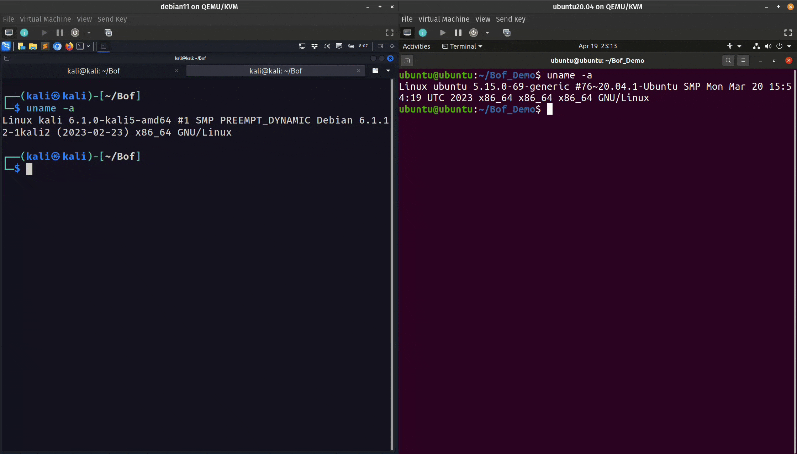

# KrakenKon2022
Presentation and codes used in the presentation

# Systems Used
- Ubuntu 20.04 with gcc version 9.4.0
- Kali Linux with python3 installed

# How to compile calling_conv.c
$ gcc calling_conv.c -o calling_conv

# How to compile code for traditional buffer overflow exploit
$ gcc -Wall -O0 -g -fno-omit-frame-pointer -Wno-deprecated-declarations -D_FORTIFY_SOURCE=0 -Wno-format -Wno-format-security -z norelro -z execstack -fno-stack-protector -no-pie -o bof_demo bof_demo.c

# To disable ASLR in Ubuntu
$ echo "0" >/proc/sys/kernel/randomize_va_space

# To enable ASLR in Ubuntu
$ echo "2" >/proc/sys/kernel/randomize_va_space

# How to compile bof_demo.c code for ROP exploit
$ gcc -O3 bof_demo.c -o bof_demo -D_FORTIFY_SOURCE=0 -fno-stack-protector -no-pie

# To obtain "gadgets" with ROPGadget
$ ROPGadget --binary ./bof_demo

# To find "main" address in the binary using objdump
$ objdump -d bof_demo | grep -i main

# To find "puts" address in the binary using objdump
$ objdump -d bof_demo | grep -i puts

# To run bof_demo as a remote service with netcat as root
$ sudo nc -k -lvp 443 -e ./bof_demo

# To run exploit 
$ python3 exploit_rop.py

# Demo

